Bellabeat Time - smartwatch market analysis
================

## How Can a Wellness Technology Company Play It Smart? 🧐

<center>


</center>

### 📋 Scenario

Bellabeat is a high-tech manufacturer of health-focused products for
women. Bellabeat is a successful small company, but they have the
potential to become a larger player in the global smart device market.
Urška Sršen, co-founder and Chief Creative Officer of Bellabeat,
believes that analyzing smart device fitness data could help unlock new
growth opportunities for the company. In this case study, we shall focus
on one of Bellabeat’s products (the Time smart-watch) and analyze smart
device data to gain insight into how consumers are using their smart
devices. These insights will then help guide marketing strategy for the
company. We present this analysis in this case study along with
high-level recommendations for Bellabeat’s marketing strategy.

### 🎭 Characters

- **Urška Sršen:** Bellabeat’s cofounder and Chief Creative Officer

- **Sando Mur:** Mathematician and Bellabeat’s cofounder; key member of
  the Bellabeat executive team

- **Bellabeat marketing analytics team:** A team of data analysts
  responsible for collecting, analyzing, and reporting data that helps
  guide Bellabeat’s marketing strategy.

### 📦 Products

- **Bellabeat app:** The Bellabeat app provides users with health data
  related to their activity, sleep, stress,  
  menstrual cycle, and mindfulness habits. This data can help users
  better understand their current habits and make healthy decisions. The
  Bellabeat app connects to their line of smart wellness products.

- **Leaf:** Bellabeat’s classic wellness tracker can be worn as a
  bracelet, necklace, or clip. The Leaf tracker connects to the
  Bellabeat app to track activity, sleep, and stress.

- **Time:** This wellness watch combines the timeless look of a classic
  timepiece with smart technology to track user activity, sleep, and
  stress. The Time watch connects to the Bellabeat app to provide you
  with insights into your daily wellness.

- **Spring:** This is a water bottle that tracks daily water intake
  using smart technology to ensure that you are  
  appropriately hydrated throughout the day. The Spring bottle connects
  to the Bellabeat app to track your  
  hydration levels.

- **Bellabeat membership:** Bellabeat also offers a subscription-based
  membership program for users. Membership gives users 24/7 access to
  fully personalized guidance on nutrition, activity, sleep, health and
  beauty, and mindfulness based on their lifestyle and goals.

### 📕 About the company

Urška Sršen and Sando Mur founded Bellabeat, a high-tech company that
manufactures health-focused smart products. Sršen used her background as
an artist to develop beautifully designed technology that informs and
inspires women around the world. Collecting data on activity, sleep,
stress, and reproductive health has allowed Bellabeat to empower women
with knowledge about their own health and habits. Since it was founded
in 2013, Bellabeat has grown rapidly and quickly positioned itself as a
tech-driven wellness company for women.

By 2016, Bellabeat had opened offices around the world and launched
multiple products. Bellabeat products became available through a growing
number of online retailers in addition to their own e-commerce channel
on their website. The company has invested in traditional advertising
media, such as radio, out-of-home billboards, print, and television, but
focuses on digital marketing extensively. Bellabeat invests year-round
in Google Search, maintaining active Facebook and Instagram pages, and
consistently engages consumers on Twitter. Additionally, Bellabeat runs
video ads on YouTube and display ads on the Google Display Network to
support campaigns around key marketing dates.

Sršen knows that an analysis of Bellabeat’s available consumer data
would reveal more opportunities for growth. She has asked the marketing
analytics team to focus on a Bellabeat product and analyze smart device
usage data in order to gain insight into how people are already using
their smart devices. Then, using this information, she would like
high-level recommendations for how these trends can inform Bellabeat
marketing strategy.

We follow the data analysis process using the following order:

**Ask -\> Prepare -\> Process -\> Analyze -\> Share -\> Act**

### 🤔 Ask

In this section, we identify the business task and consider key
stakeholders.

The following are the questions we may ask:

1.  What are some trends in smart device usage? 📈

2.  How could these trends apply to Bellabeat customers? 🛍️

3.  How could these trends help influence Bellabeat marketing strategy?
    💬

**Business Task Statement:** Using current trends in smart-watch usage
data, identify how these trends relate to Bellabeat customers, and
consequently identify how this may influence the Bellabeat marketing
strategy.

### 📝 Prepare

We download, store, and prepare our dataset, and determine if it is
appropriate for our analysis in this step.

The dataset that we choose is [FitBit Fitness Tracker
Data](https://www.kaggle.com/datasets/arashnic/fitbit "FitBit Fitness Tracker Data")
provided by the user [Möbius](https://www.kaggle.com/arashnic "Möbius")
in the Kaggle dataset repository. It contains personal fitness tracker
from thirty fitbit users. Thirty eligible Fitbit users consented to the
submission of personal tracker data, including minute-level output for
physical activity, heart rate, and sleep monitoring. It includes
information about daily activity, steps, and heart rate that can be used
to explore users’ habits.

#### 🗄️ Data storage and organization

The data is stored in the form of multiple CSV files. There are CSV
files for all activity (by day), steps taken, calories burned, activity
intensity (by day, hour and minute), heart-rate (by seconds), sleep
(days and minutes), METs (minutes), and weight logs (day of weighing).
The data for steps taken, calories burned, activity intensity also have
both the long and wide variants of data available. All other data are in
long format only.

#### 👍 How “good” is this data? How useful is it for our analysis?

We now see if this dataset meets the ROCCC principles.

This dataset was generated by respondents to a distributed survey via
Amazon Mechanical Turk between 03.12.2016-05.12.2016. Thirty eligible
Fitbit users consented to the submission of personal tracker data,
including minute-level output for physical activity, heart rate, and
sleep monitoring. Individual reports can be parsed by export session ID
(column A) or timestamp (column B).

**👌 Reliability:** Considering the methodology of data gathering, this
data was directly obtained from FitBit devices of consenting Amazon
Mechanical Turk survey respondents and can thus be considered reliable
fitness data.

**✨ Originality:** This dataset was indepedently obtained via a
distributed survey and is original.

**🌐 Comprehensiveness:** As discussed in the previous section, this
data has comprehensive attributes that measure fitness tracker data
collection.

**🌟 Current:** The data was collected in 2016 and is contemporary.
However, the insights derived from these data may not be relevant to the
current post-pandemic fitness market.

**🔎 Cited:** The dataset is widely used for analytical purposes and has
been used in almost 3,000 notebooks on Kaggle alone.

We can derive some general insights around smart-watch usage from this
data. However, we should consider the limitations that this data has
while determining our plan of action.

#### 🧩 Other problems and considerations

**🧪 Sample size:** The sample size is only of 30 people and may not
reflect the general population accurately.

**📜 Licensing:** The data is licensed under the Creative Commons [CC0:
Public Domain](https://creativecommons.org/publicdomain/zero/1.0/)
license and can be used for our analysis, since it is a publicly
accessible dataset.

**🔐 Privacy and security:** The survey respondents do not reveal any
personal information that could be used to identify them. There is no
privacy or security concern with this dataset.

**👩‍🦽 Accessibility and integrity:** The dataset has a lot of information
and may be hard to read at glance. We shall convert it to a format that
is more accessible by merging it into a single dataset with all
attributes by day.

### ⚙️ Process

We load the required libraries to prepare our data.

``` r
library(tidyverse)
```

    ## ── Attaching core tidyverse packages ──────────────────────── tidyverse 2.0.0 ──
    ## ✔ dplyr     1.1.0     ✔ readr     2.1.4
    ## ✔ forcats   1.0.0     ✔ stringr   1.5.0
    ## ✔ ggplot2   3.4.1     ✔ tibble    3.1.8
    ## ✔ lubridate 1.9.2     ✔ tidyr     1.3.0
    ## ✔ purrr     1.0.1     
    ## ── Conflicts ────────────────────────────────────────── tidyverse_conflicts() ──
    ## ✖ dplyr::filter() masks stats::filter()
    ## ✖ dplyr::lag()    masks stats::lag()
    ## ℹ Use the ]8;;http://conflicted.r-lib.org/conflicted package]8;; to force all conflicts to become errors

#### 📁 Base dataset

We read the `dailyActivity_merged.csv` file and analyze the columns.

``` r
daily_activity_df <- read_csv('data/fitbit_data/dailyActivity_merged.csv')
```

    ## Rows: 940 Columns: 15
    ## ── Column specification ────────────────────────────────────────────────────────
    ## Delimiter: ","
    ## chr  (1): ActivityDate
    ## dbl (14): Id, TotalSteps, TotalDistance, TrackerDistance, LoggedActivitiesDi...
    ## 
    ## ℹ Use `spec()` to retrieve the full column specification for this data.
    ## ℹ Specify the column types or set `show_col_types = FALSE` to quiet this message.

``` r
head(daily_activity_df)
```

    ## # A tibble: 6 × 15
    ##       Id Activ…¹ Total…² Total…³ Track…⁴ Logge…⁵ VeryA…⁶ Moder…⁷ Light…⁸ Seden…⁹
    ##    <dbl> <chr>     <dbl>   <dbl>   <dbl>   <dbl>   <dbl>   <dbl>   <dbl>   <dbl>
    ## 1 1.50e9 4/12/2…   13162    8.5     8.5        0    1.88   0.550    6.06       0
    ## 2 1.50e9 4/13/2…   10735    6.97    6.97       0    1.57   0.690    4.71       0
    ## 3 1.50e9 4/14/2…   10460    6.74    6.74       0    2.44   0.400    3.91       0
    ## 4 1.50e9 4/15/2…    9762    6.28    6.28       0    2.14   1.26     2.83       0
    ## 5 1.50e9 4/16/2…   12669    8.16    8.16       0    2.71   0.410    5.04       0
    ## 6 1.50e9 4/17/2…    9705    6.48    6.48       0    3.19   0.780    2.51       0
    ## # … with 5 more variables: VeryActiveMinutes <dbl>, FairlyActiveMinutes <dbl>,
    ## #   LightlyActiveMinutes <dbl>, SedentaryMinutes <dbl>, Calories <dbl>, and
    ## #   abbreviated variable names ¹​ActivityDate, ²​TotalSteps, ³​TotalDistance,
    ## #   ⁴​TrackerDistance, ⁵​LoggedActivitiesDistance, ⁶​VeryActiveDistance,
    ## #   ⁷​ModeratelyActiveDistance, ⁸​LightActiveDistance, ⁹​SedentaryActiveDistance

``` r
colnames(daily_activity_df)
```

    ##  [1] "Id"                       "ActivityDate"            
    ##  [3] "TotalSteps"               "TotalDistance"           
    ##  [5] "TrackerDistance"          "LoggedActivitiesDistance"
    ##  [7] "VeryActiveDistance"       "ModeratelyActiveDistance"
    ##  [9] "LightActiveDistance"      "SedentaryActiveDistance" 
    ## [11] "VeryActiveMinutes"        "FairlyActiveMinutes"     
    ## [13] "LightlyActiveMinutes"     "SedentaryMinutes"        
    ## [15] "Calories"

#### 🗂️ Other datasets

The dataset has the ID for each respondent, activity date, step data,
distance, intensity, activity minutes, and calories burned. However,
this dataset is missing heart rate information, sleep data, and weight
logs.

We shall now merge this information to `daily_activity_df`.

``` r
heartrate_df <- read_csv("data/fitbit_data/heartrate_seconds_merged.csv")
```

    ## Rows: 2483658 Columns: 3
    ## ── Column specification ────────────────────────────────────────────────────────
    ## Delimiter: ","
    ## chr (1): Time
    ## dbl (2): Id, Value
    ## 
    ## ℹ Use `spec()` to retrieve the full column specification for this data.
    ## ℹ Specify the column types or set `show_col_types = FALSE` to quiet this message.

``` r
head(heartrate_df)
```

    ## # A tibble: 6 × 3
    ##           Id Time                 Value
    ##        <dbl> <chr>                <dbl>
    ## 1 2022484408 4/12/2016 7:21:00 AM    97
    ## 2 2022484408 4/12/2016 7:21:05 AM   102
    ## 3 2022484408 4/12/2016 7:21:10 AM   105
    ## 4 2022484408 4/12/2016 7:21:20 AM   103
    ## 5 2022484408 4/12/2016 7:21:25 AM   101
    ## 6 2022484408 4/12/2016 7:22:05 AM    95

We notice that we have the heart rate for every few seconds. To merge
with `daily_activity_df`, we require that the data be averaged over by
day.

We shall now create a `Date` column, group the data by `Date`, average
the heart rate `Value` to get the resultant dataset that can be merged
with `daily_activity_df`.

``` r
heartrate_dates <- str_split_fixed(heartrate_df$Time, " ", 2)[,1]
heartrate_df$Date <- heartrate_dates
head(heartrate_df)
```

    ## # A tibble: 6 × 4
    ##           Id Time                 Value Date     
    ##        <dbl> <chr>                <dbl> <chr>    
    ## 1 2022484408 4/12/2016 7:21:00 AM    97 4/12/2016
    ## 2 2022484408 4/12/2016 7:21:05 AM   102 4/12/2016
    ## 3 2022484408 4/12/2016 7:21:10 AM   105 4/12/2016
    ## 4 2022484408 4/12/2016 7:21:20 AM   103 4/12/2016
    ## 5 2022484408 4/12/2016 7:21:25 AM   101 4/12/2016
    ## 6 2022484408 4/12/2016 7:22:05 AM    95 4/12/2016

``` r
heartrate_grouped_df <- heartrate_df %>% 
  group_by(Id, Date) %>% 
  summarise(AvgHeartRate = mean(Value))
```

    ## `summarise()` has grouped output by 'Id'. You can override using the `.groups`
    ## argument.

``` r
head(heartrate_grouped_df)
```

    ## # A tibble: 6 × 3
    ## # Groups:   Id [1]
    ##           Id Date      AvgHeartRate
    ##        <dbl> <chr>            <dbl>
    ## 1 2022484408 4/12/2016         75.8
    ## 2 2022484408 4/13/2016         80.3
    ## 3 2022484408 4/14/2016         72.6
    ## 4 2022484408 4/15/2016         80.4
    ## 5 2022484408 4/16/2016         76.0
    ## 6 2022484408 4/17/2016         83.9

Now, we load and verify the sleep data.

``` r
sleep_df <- read_csv("data/fitbit_data/sleepDay_merged.csv")
```

    ## Rows: 413 Columns: 5
    ## ── Column specification ────────────────────────────────────────────────────────
    ## Delimiter: ","
    ## chr (1): SleepDay
    ## dbl (4): Id, TotalSleepRecords, TotalMinutesAsleep, TotalTimeInBed
    ## 
    ## ℹ Use `spec()` to retrieve the full column specification for this data.
    ## ℹ Specify the column types or set `show_col_types = FALSE` to quiet this message.

``` r
head(sleep_df)
```

    ## # A tibble: 6 × 5
    ##           Id SleepDay              TotalSleepRecords TotalMinutesAsleep TotalT…¹
    ##        <dbl> <chr>                             <dbl>              <dbl>    <dbl>
    ## 1 1503960366 4/12/2016 12:00:00 AM                 1                327      346
    ## 2 1503960366 4/13/2016 12:00:00 AM                 2                384      407
    ## 3 1503960366 4/15/2016 12:00:00 AM                 1                412      442
    ## 4 1503960366 4/16/2016 12:00:00 AM                 2                340      367
    ## 5 1503960366 4/17/2016 12:00:00 AM                 1                700      712
    ## 6 1503960366 4/19/2016 12:00:00 AM                 1                304      320
    ## # … with abbreviated variable name ¹​TotalTimeInBed

We convert the `SleepDay` column from date-time format to date, since it
has only the time `12:00:00 AM` for all the days.

``` r
sleep_df$Date <- str_split_fixed(sleep_df$SleepDay, " ", 2)[,1]
sleep_df <- select(sleep_df, -SleepDay)
head(sleep_df)
```

    ## # A tibble: 6 × 5
    ##           Id TotalSleepRecords TotalMinutesAsleep TotalTimeInBed Date     
    ##        <dbl>             <dbl>              <dbl>          <dbl> <chr>    
    ## 1 1503960366                 1                327            346 4/12/2016
    ## 2 1503960366                 2                384            407 4/13/2016
    ## 3 1503960366                 1                412            442 4/15/2016
    ## 4 1503960366                 2                340            367 4/16/2016
    ## 5 1503960366                 1                700            712 4/17/2016
    ## 6 1503960366                 1                304            320 4/19/2016

Now, we load and verify the weight log info.

``` r
weight_log_df <- read_csv("data/fitbit_data/weightLogInfo_merged.csv")
```

    ## Rows: 67 Columns: 8
    ## ── Column specification ────────────────────────────────────────────────────────
    ## Delimiter: ","
    ## chr (1): Date
    ## dbl (6): Id, WeightKg, WeightPounds, Fat, BMI, LogId
    ## lgl (1): IsManualReport
    ## 
    ## ℹ Use `spec()` to retrieve the full column specification for this data.
    ## ℹ Specify the column types or set `show_col_types = FALSE` to quiet this message.

``` r
head(weight_log_df)
```

    ## # A tibble: 6 × 8
    ##           Id Date                  WeightKg Weight…¹   Fat   BMI IsMan…²   LogId
    ##        <dbl> <chr>                    <dbl>    <dbl> <dbl> <dbl> <lgl>     <dbl>
    ## 1 1503960366 5/2/2016 11:59:59 PM      52.6     116.    22  22.6 TRUE    1.46e12
    ## 2 1503960366 5/3/2016 11:59:59 PM      52.6     116.    NA  22.6 TRUE    1.46e12
    ## 3 1927972279 4/13/2016 1:08:52 AM     134.      294.    NA  47.5 FALSE   1.46e12
    ## 4 2873212765 4/21/2016 11:59:59 PM     56.7     125.    NA  21.5 TRUE    1.46e12
    ## 5 2873212765 5/12/2016 11:59:59 PM     57.3     126.    NA  21.7 TRUE    1.46e12
    ## 6 4319703577 4/17/2016 11:59:59 PM     72.4     160.    25  27.5 TRUE    1.46e12
    ## # … with abbreviated variable names ¹​WeightPounds, ²​IsManualReport

The respondents weighed themselves only once per day at around the same
time. So the time when they weighed themselves is not relevant. We
remove the time and retain the dates.

``` r
weight_log_df$Date <- str_split_fixed(weight_log_df$Date, " ", 2)[,1]
head(weight_log_df)
```

    ## # A tibble: 6 × 8
    ##           Id Date      WeightKg WeightPounds   Fat   BMI IsManualReport    LogId
    ##        <dbl> <chr>        <dbl>        <dbl> <dbl> <dbl> <lgl>             <dbl>
    ## 1 1503960366 5/2/2016      52.6         116.    22  22.6 TRUE            1.46e12
    ## 2 1503960366 5/3/2016      52.6         116.    NA  22.6 TRUE            1.46e12
    ## 3 1927972279 4/13/2016    134.          294.    NA  47.5 FALSE           1.46e12
    ## 4 2873212765 4/21/2016     56.7         125.    NA  21.5 TRUE            1.46e12
    ## 5 2873212765 5/12/2016     57.3         126.    NA  21.7 TRUE            1.46e12
    ## 6 4319703577 4/17/2016     72.4         160.    25  27.5 TRUE            1.46e12

#### 🔗 Combining datasets

We now merge `heartrate_grouped_df`, `sleep_df`, and `weight_log_df` to
`daily_activity_df`.

``` r
daily_activity_df_merged <- daily_activity_df %>% 
  left_join(heartrate_grouped_df, by = join_by(Id == Id, ActivityDate == Date)) %>% 
  left_join(sleep_df, by = join_by(Id == Id, ActivityDate == Date)) %>% 
  left_join(weight_log_df, by = join_by(Id == Id, ActivityDate == Date)) %>% 
  arrange(desc(Calories))
```

    ## Warning in left_join(., sleep_df, by = join_by(Id == Id, ActivityDate == : Each row in `x` is expected to match at most 1 row in `y`.
    ## ℹ Row 436 of `x` matches multiple rows.
    ## ℹ If multiple matches are expected, set `multiple = "all"` to silence this
    ##   warning.

``` r
head(daily_activity_df_merged)
```

    ## # A tibble: 6 × 25
    ##       Id Activ…¹ Total…² Total…³ Track…⁴ Logge…⁵ VeryA…⁶ Moder…⁷ Light…⁸ Seden…⁹
    ##    <dbl> <chr>     <dbl>   <dbl>   <dbl>   <dbl>   <dbl>   <dbl>   <dbl>   <dbl>
    ## 1 6.12e9 4/21/2…   19542   15.0    15.0        0   0.980  0.400     5.62       0
    ## 2 5.58e9 4/17/2…   12231    9.14    9.14       0   5.98   0.830     2.32       0
    ## 3 8.88e9 4/16/2…   29326   25.3    25.3        0  13.2    1.21     10.7        0
    ## 4 5.58e9 5/1/20…   13368    9.99    9.99       0   5.31   1.44      3.24       0
    ## 5 5.58e9 4/30/2…   12363    9.24    9.24       0   5.83   0.790     2.61       0
    ## 6 8.88e9 4/30/2…   27745   26.7    26.7        0  21.7    0.0800    4.93       0
    ## # … with 15 more variables: VeryActiveMinutes <dbl>, FairlyActiveMinutes <dbl>,
    ## #   LightlyActiveMinutes <dbl>, SedentaryMinutes <dbl>, Calories <dbl>,
    ## #   AvgHeartRate <dbl>, TotalSleepRecords <dbl>, TotalMinutesAsleep <dbl>,
    ## #   TotalTimeInBed <dbl>, WeightKg <dbl>, WeightPounds <dbl>, Fat <dbl>,
    ## #   BMI <dbl>, IsManualReport <lgl>, LogId <dbl>, and abbreviated variable
    ## #   names ¹​ActivityDate, ²​TotalSteps, ³​TotalDistance, ⁴​TrackerDistance,
    ## #   ⁵​LoggedActivitiesDistance, ⁶​VeryActiveDistance, …

We now have all kinds of data in one data frame.

**Limitations:** We observe that there are some missing values for heart
rate, sleep information, and weight data. This may be because:

- Not all FitBit devices have a heart rate monitor.

- Not all FitBit devices measure sleep.

- Some users charge their FitBit smart-watch overnight and thus the
  device does not measure sleep data.

- Some users do not weigh regularly.

- Some users weighing scale does not measure body fat.

### 🧠 Analyze

#### 🛠️ Preparing data

To make our analysis effective, let us categorize users based on their
activity and their sleep.

``` r
daily_activity_df_merged <- daily_activity_df_merged %>%
  mutate(UserActivityType = case_when(
      VeryActiveMinutes > mean(VeryActiveMinutes) ~ "Very Active",
      FairlyActiveMinutes > mean(FairlyActiveMinutes) ~ "Fairly Active",
      LightlyActiveMinutes > mean(LightlyActiveMinutes) ~ "Lightly Active",
      SedentaryMinutes > mean(SedentaryMinutes) ~ "Sedentary"
    )
  ) %>% 
  mutate(UserSleepType = case_when(
      TotalMinutesAsleep < 5*60 ~ "Light",
      TotalMinutesAsleep > 5*60 & TotalMinutesAsleep < 7*60 ~ "Moderate",
      TotalMinutesAsleep > 7*60 ~ "Heavy"
    )
  )

head(daily_activity_df_merged)
```

    ## # A tibble: 6 × 27
    ##       Id Activ…¹ Total…² Total…³ Track…⁴ Logge…⁵ VeryA…⁶ Moder…⁷ Light…⁸ Seden…⁹
    ##    <dbl> <chr>     <dbl>   <dbl>   <dbl>   <dbl>   <dbl>   <dbl>   <dbl>   <dbl>
    ## 1 6.12e9 4/21/2…   19542   15.0    15.0        0   0.980  0.400     5.62       0
    ## 2 5.58e9 4/17/2…   12231    9.14    9.14       0   5.98   0.830     2.32       0
    ## 3 8.88e9 4/16/2…   29326   25.3    25.3        0  13.2    1.21     10.7        0
    ## 4 5.58e9 5/1/20…   13368    9.99    9.99       0   5.31   1.44      3.24       0
    ## 5 5.58e9 4/30/2…   12363    9.24    9.24       0   5.83   0.790     2.61       0
    ## 6 8.88e9 4/30/2…   27745   26.7    26.7        0  21.7    0.0800    4.93       0
    ## # … with 17 more variables: VeryActiveMinutes <dbl>, FairlyActiveMinutes <dbl>,
    ## #   LightlyActiveMinutes <dbl>, SedentaryMinutes <dbl>, Calories <dbl>,
    ## #   AvgHeartRate <dbl>, TotalSleepRecords <dbl>, TotalMinutesAsleep <dbl>,
    ## #   TotalTimeInBed <dbl>, WeightKg <dbl>, WeightPounds <dbl>, Fat <dbl>,
    ## #   BMI <dbl>, IsManualReport <lgl>, LogId <dbl>, UserActivityType <chr>,
    ## #   UserSleepType <chr>, and abbreviated variable names ¹​ActivityDate,
    ## #   ²​TotalSteps, ³​TotalDistance, ⁴​TrackerDistance, ⁵​LoggedActivitiesDistance, …

Let us also convert the date column from `chr` to `date` type.

``` r
daily_activity_df_merged$ActivityDate <- as.Date(daily_activity_df_merged$ActivityDate, "%m/%d/%Y")
head(daily_activity_df_merged)
```

    ## # A tibble: 6 × 27
    ##           Id ActivityD…¹ Total…² Total…³ Track…⁴ Logge…⁵ VeryA…⁶ Moder…⁷ Light…⁸
    ##        <dbl> <date>        <dbl>   <dbl>   <dbl>   <dbl>   <dbl>   <dbl>   <dbl>
    ## 1 6117666160 2016-04-21    19542   15.0    15.0        0   0.980  0.400     5.62
    ## 2 5577150313 2016-04-17    12231    9.14    9.14       0   5.98   0.830     2.32
    ## 3 8877689391 2016-04-16    29326   25.3    25.3        0  13.2    1.21     10.7 
    ## 4 5577150313 2016-05-01    13368    9.99    9.99       0   5.31   1.44      3.24
    ## 5 5577150313 2016-04-30    12363    9.24    9.24       0   5.83   0.790     2.61
    ## 6 8877689391 2016-04-30    27745   26.7    26.7        0  21.7    0.0800    4.93
    ## # … with 18 more variables: SedentaryActiveDistance <dbl>,
    ## #   VeryActiveMinutes <dbl>, FairlyActiveMinutes <dbl>,
    ## #   LightlyActiveMinutes <dbl>, SedentaryMinutes <dbl>, Calories <dbl>,
    ## #   AvgHeartRate <dbl>, TotalSleepRecords <dbl>, TotalMinutesAsleep <dbl>,
    ## #   TotalTimeInBed <dbl>, WeightKg <dbl>, WeightPounds <dbl>, Fat <dbl>,
    ## #   BMI <dbl>, IsManualReport <lgl>, LogId <dbl>, UserActivityType <chr>,
    ## #   UserSleepType <chr>, and abbreviated variable names ¹​ActivityDate, …

#### ⏳ Time series analysis

Let us visualize how the calories burned in general relate with time.

``` r
ggplot(daily_activity_df_merged, aes(x=ActivityDate, y=Calories)) +
  geom_line() +
  geom_smooth() +
  xlab('Activity Date')
```

    ## `geom_smooth()` using method = 'loess' and formula = 'y ~ x'

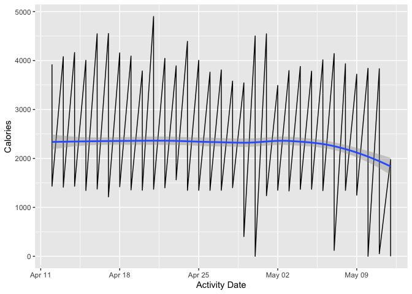<!-- -->

We note that the respondents have had a consistent exercise schedule
with rest days and active days.

Let us analyze how this relationship work with respect to user activity
type.

``` r
ggplot(daily_activity_df_merged, aes(x=ActivityDate, y=Calories)) +
  geom_line() +
  geom_smooth() +
  facet_wrap(~UserActivityType) +
  xlab('Activity Date')
```

    ## `geom_smooth()` using method = 'loess' and formula = 'y ~ x'

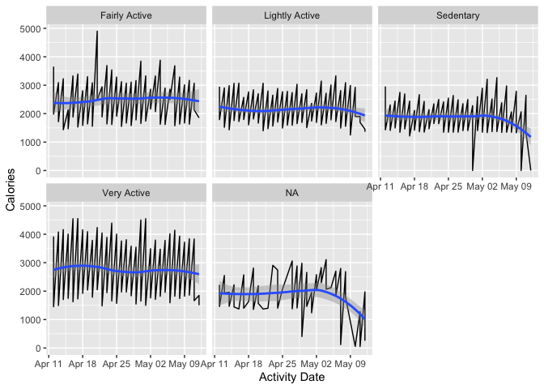<!-- -->

We observe that active users, even if moderately active, were still
consistently active, while sedentary and lightly active users
demonstrated drop in activity at the beginning of May.

*The less active the user, the higher their chance to lose motivation to
burn calories consistently.*

#### 🖇️ Finding correlations

We plot the relationship between calories, total steps, and total
distance.

``` r
ggplot(daily_activity_df_merged) +
  geom_point(mapping = aes(x=TotalSteps, y=Calories, color=TotalDistance)) +
  geom_smooth(mapping = aes(x=TotalSteps, y=Calories)) +
  labs(title = 'Relationship between steps, calories, and distance',
       subtitle = 'The longer the distance walked and steps taken, the more the calories burned',
       x = 'Total Steps',
       color = 'Total Distance')
```

    ## `geom_smooth()` using method = 'loess' and formula = 'y ~ x'

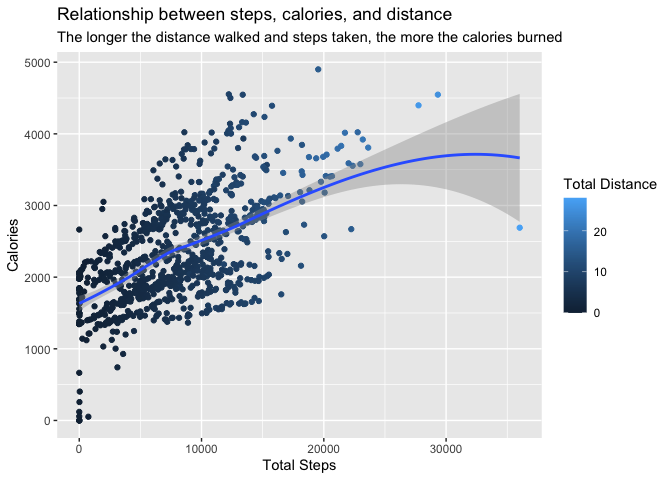<!-- -->

We see that the three variables above are correlated.

#### Activity and sleep patterns

``` r
daily_activity_df_merged %>%
  select(Id, UserActivityType) %>%
  drop_na() %>% 
  group_by(Id) %>% 
  slice(1) %>% 
  ggplot() +
    geom_bar(mapping = aes(x=UserActivityType, fill=UserActivityType)) +
    labs(x = '', fill = 'User type')
```

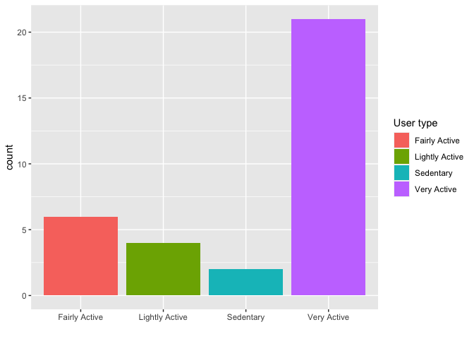<!-- -->

Very active users (by time) tend to use smart-watches more followed by
fairly active users. Let us analyze the same with sleep patterns of
users.

``` r
daily_activity_df_merged %>%
  select(Id, UserSleepType) %>%
  drop_na() %>% 
  group_by(Id) %>% 
  slice(1) %>% 
  ggplot() +
    geom_bar(mapping = aes(x=UserSleepType, fill=UserSleepType)) +
    labs(x = '', fill = 'User sleep pattern')
```

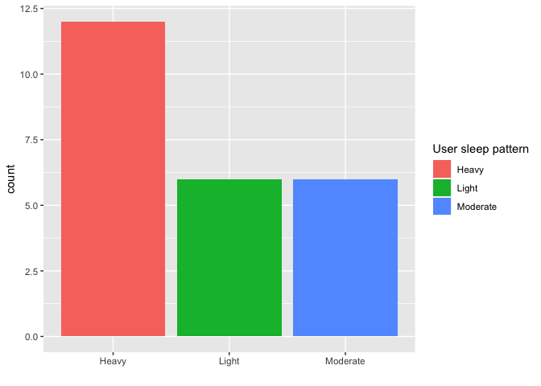<!-- -->

Most sleepers have a heavy sleeping pattern (i.e., they sleep for more
than 7 hours/day).

Let us compare the calories vs. step count relationship based on user
type.

``` r
ggplot(drop_na(daily_activity_df_merged, UserActivityType)) +
  geom_point(mapping = aes(x=TotalSteps, y=Calories, color=UserActivityType)) +
  geom_smooth(mapping = aes(x=TotalSteps, y=Calories)) +
  labs(title = 'Relationship between steps, calories, and user activity type',
       subtitle = 'More active users burned more calories',
       x = 'Total Steps',
       color = 'User activity type')
```

    ## `geom_smooth()` using method = 'loess' and formula = 'y ~ x'

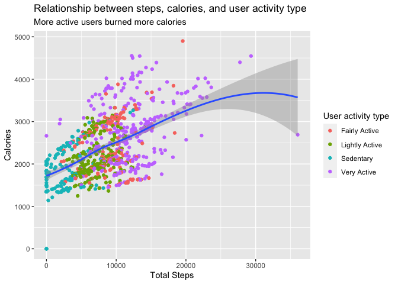<!-- -->

#### 😴 Do active users get good sleep?

``` r
ggplot(daily_activity_df_merged) +
  geom_point(mapping = aes(x=TotalMinutesAsleep, y=Calories, color=UserActivityType)) +
  geom_smooth(mapping = aes(x=TotalMinutesAsleep, y=Calories)) +
  labs(title = 'Relationship between sleep and activity',
       x = 'Total Minutes Asleep',
       color = 'User activity type')
```

    ## `geom_smooth()` using method = 'loess' and formula = 'y ~ x'

    ## Warning: Removed 530 rows containing non-finite values (`stat_smooth()`).

    ## Warning: Removed 530 rows containing missing values (`geom_point()`).

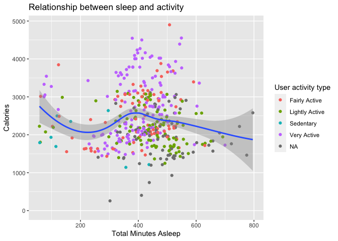<!-- -->

Active respondents had moderate sleep levels. Let us go into more detail
with the categorization.

``` r
ggplot(daily_activity_df_merged) +
  geom_point(mapping = aes(x=TotalMinutesAsleep, y=Calories)) +
  geom_smooth(mapping = aes(x=TotalMinutesAsleep, y=Calories)) +
  facet_wrap(~UserActivityType)
```

    ## `geom_smooth()` using method = 'loess' and formula = 'y ~ x'

    ## Warning: Removed 530 rows containing non-finite values (`stat_smooth()`).

    ## Warning: Removed 530 rows containing missing values (`geom_point()`).

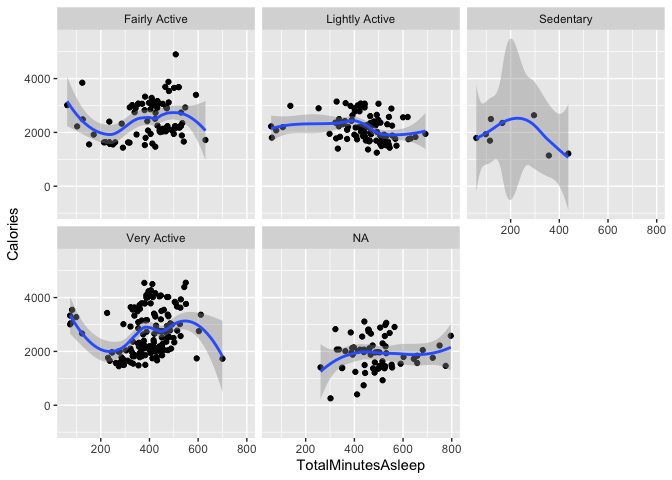<!-- -->

``` r
  labs(title = 'Relationship between sleep and activity',
       x = 'Total Minutes Asleep')
```

    ## $x
    ## [1] "Total Minutes Asleep"
    ## 
    ## $title
    ## [1] "Relationship between sleep and activity"
    ## 
    ## attr(,"class")
    ## [1] "labels"

Sedentary respondents had the worst sleep in general. Respondents with
even a little activity had better sleep.

### 📺 Share

These are the following plots we can share with the stakeholders.

#### 🏃🏻 Active metrics are correlated

``` r
ggplot(drop_na(daily_activity_df_merged, UserActivityType)) +
  geom_point(mapping = aes(x=TotalSteps, y=Calories, color=UserActivityType)) +
  geom_smooth(mapping = aes(x=TotalSteps, y=Calories)) +
  labs(title = 'Relationship between steps, calories, and user activity type',
       subtitle = 'More active users burned more calories',
       x = 'Total Steps',
       color = 'User activity type',
       caption = 'Based on FitBit data by 33 survey respondents for April-May 2016')
```

    ## `geom_smooth()` using method = 'loess' and formula = 'y ~ x'

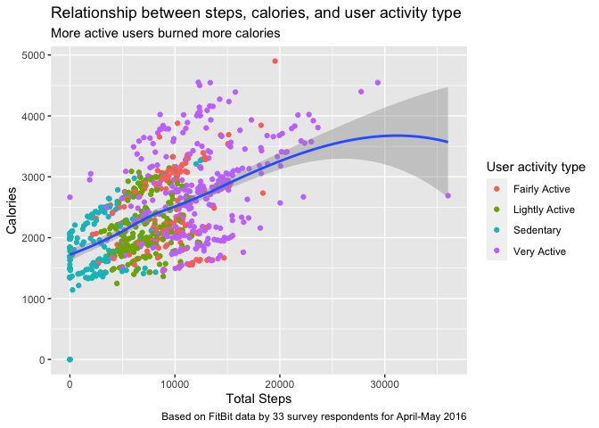<!-- -->

The graph shows the relationship between the steps, calories, and user
activity type.

It essentially says that active users take more steps in a day and also
burn more calories.

#### ❤️ Smart-watches are popular among healthy users

``` r
daily_activity_df_merged %>%
  select(Id, UserActivityType) %>%
  drop_na() %>% 
  group_by(Id) %>% 
  slice(1) %>% 
  ggplot() +
    geom_bar(mapping = aes(x=UserActivityType, fill=UserActivityType)) +
    labs(title = 'Users by activity type',
         x = '',
         fill = 'User activity type',
         caption = 'Based on FitBit data by 33 survey respondents for April-May 2016')
```

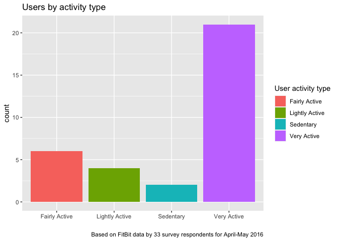<!-- -->

``` r
daily_activity_df_merged %>%
  select(Id, UserSleepType) %>%
  drop_na() %>% 
  group_by(Id) %>% 
  ggplot() +
    geom_bar(mapping = aes(x=UserSleepType, fill=UserSleepType)) +
    labs(x = '', fill = 'User sleep pattern',
         caption = 'Based on FitBit data by 33 survey respondents for April-May 2016')
```

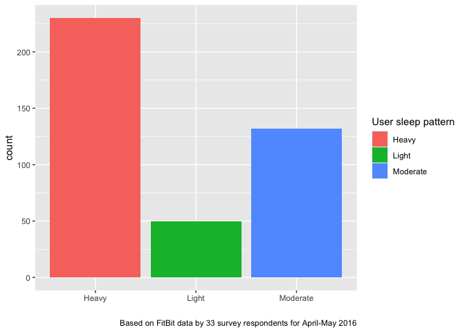<!-- -->

This chart shows that more active users are likely to use and report
fitness data. Active users are more interested in smart-watches.
Similarly, these users also in general have better sleep.

*Smart-watch customers tend to be healthier and sleep well.*

#### 🥱 Active smart-watch users sleep better

``` r
daily_activity_df_merged %>%
  drop_na(UserActivityType) %>%
ggplot() +
  geom_point(mapping = aes(x=TotalMinutesAsleep, y=Calories)) +
  geom_smooth(mapping = aes(x=TotalMinutesAsleep, y=Calories)) +
  facet_wrap(~UserActivityType)
```

    ## `geom_smooth()` using method = 'loess' and formula = 'y ~ x'

    ## Warning: Removed 517 rows containing non-finite values (`stat_smooth()`).

    ## Warning: Removed 517 rows containing missing values (`geom_point()`).

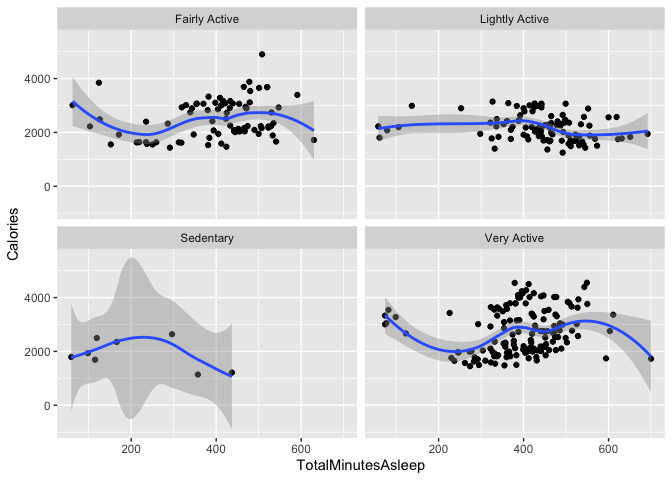<!-- -->

``` r
  labs(title = 'Relationship between sleep and activity',
         caption = 'Based on FitBit data by 33 survey respondents for April-May 2016')
```

    ## $title
    ## [1] "Relationship between sleep and activity"
    ## 
    ## $caption
    ## [1] "Based on FitBit data by 33 survey respondents for April-May 2016"
    ## 
    ## attr(,"class")
    ## [1] "labels"

Active users sleep better than sedentary ones.

#### 🏋🏼‍♂️ Consistency

``` r
daily_activity_df_merged %>%
  select(Id, UserActivityType, ActivityDate, Calories) %>%
  drop_na() %>%
  ggplot(aes(x=ActivityDate, y=Calories)) +
    geom_smooth() +
    facet_wrap(~UserActivityType) +
    labs(title = 'Calories lost with time',
         subtitle = 'Active users are consistent and lose more calories',
         x='Activity Date',
         caption = 'Based on FitBit data by 33 survey respondents for April-May 2016')
```

    ## `geom_smooth()` using method = 'loess' and formula = 'y ~ x'

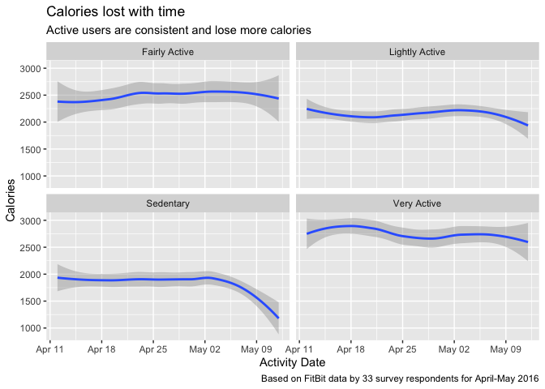<!-- -->

Active users consistently lose calories, lose more calories, and are
consistent over time.

#### ⛱️ Activity on weekends

``` r
daily_activity_df_merged_wd <- daily_activity_df_merged %>% 
  select(Id, ActivityDate, TotalSteps, Calories)

daily_activity_df_merged_wd$ActivityWeekday <- weekdays(daily_activity_df_merged_wd$ActivityDate)

head(daily_activity_df_merged_wd)
```

    ## # A tibble: 6 × 5
    ##           Id ActivityDate TotalSteps Calories ActivityWeekday
    ##        <dbl> <date>            <dbl>    <dbl> <chr>          
    ## 1 6117666160 2016-04-21        19542     4900 Thursday       
    ## 2 5577150313 2016-04-17        12231     4552 Sunday         
    ## 3 8877689391 2016-04-16        29326     4547 Saturday       
    ## 4 5577150313 2016-05-01        13368     4546 Sunday         
    ## 5 5577150313 2016-04-30        12363     4501 Saturday       
    ## 6 8877689391 2016-04-30        27745     4398 Saturday

``` r
daily_activity_df_merged_wd_summarized <- daily_activity_df_merged_wd %>% 
  select(Id, ActivityWeekday, TotalSteps, Calories) %>% 
  group_by(ActivityWeekday) %>% 
  summarize(TotalStepsWeekday = sum(TotalSteps),
            CaloriesWeekday = sum(Calories))

daily_activity_df_merged_wd_summarized$ActivityWeekday <- factor(daily_activity_df_merged_wd_summarized$ActivityWeekday, levels= c("Monday", 
    "Tuesday", "Wednesday", "Thursday", "Friday", "Saturday", "Sunday"))
daily_activity_df_merged_wd_summarized <- daily_activity_df_merged_wd_summarized[order(daily_activity_df_merged_wd_summarized$ActivityWeekday), ]

daily_activity_df_merged_wd_summarized %>% 
  ggplot() +
    geom_bar(stat='identity',
      mapping = aes(x=ActivityWeekday, y=CaloriesWeekday, fill=ActivityWeekday)) +
    labs(x = '', y='Calories burned', fill = 'Day of week',
         title = 'Calories burned by weekday',
         caption = 'Based on FitBit data by 33 survey respondents for April-May 2016')
```

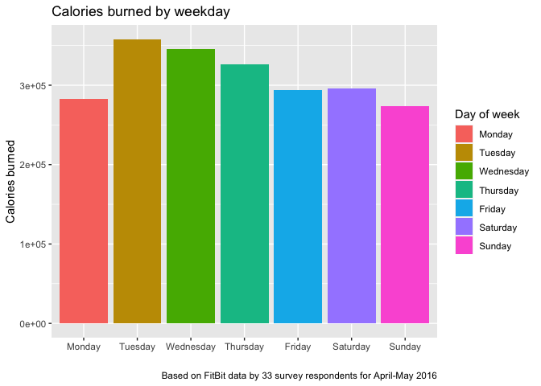<!-- -->

Respondents lost less calories on weekends compared to weekdays.
Surprisingly, they also lost less calories on Monday as compared to
other weekdays.

In general, the amount of calories burned kept declining as the weekend
approached and reset every Tuesday.

### 🎬 Act

Based on our analysis of FitBit data, to market Bellabeat Time, we
suggest the following actions to be taken by the stakeholders:

1.  There is a **strong correlation** among the features **calories
    burned, steps walked, and activity**. These statistics may be used
    to encourage potential future users to stay more active. 💪🏼
2.  The majority of people who owned FitBit, a product similar to
    Bellabeat Time, exhibited higher activity, lost more calories,
    walked more steps, and had better sleep quality. **An advertising
    campaign suggesting that smart-watch users tend to be more active
    and healthier can be used to market Bellabeat Time**. 🎯
3.  Active smart-watch users tend to have a higher sleep quality than
    sedentary users. **Improved sleep quality can be marketed as a
    side-effect of owning a Bellabeat Time device**. 💤
4.  Active users consistently lose calories, lose more calories, and are
    consistent over time. Sedentary users tend to lose motivation.
    **Active smart-watch users tend to be more consistent with burning
    calories can also be used in the campaign**. 🚀
5.  Users tend to lose motivation as the weekend approaches and stay
    motivated until the Monday of the coming week. **A feature
    encouraging walking more steps during weekends could be added to
    Bellabeat Time and marketed**. ✈️

This section concludes the data analysis process of this project.
